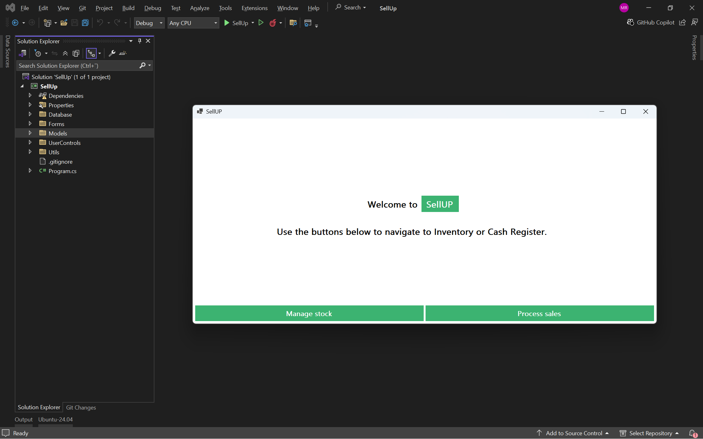
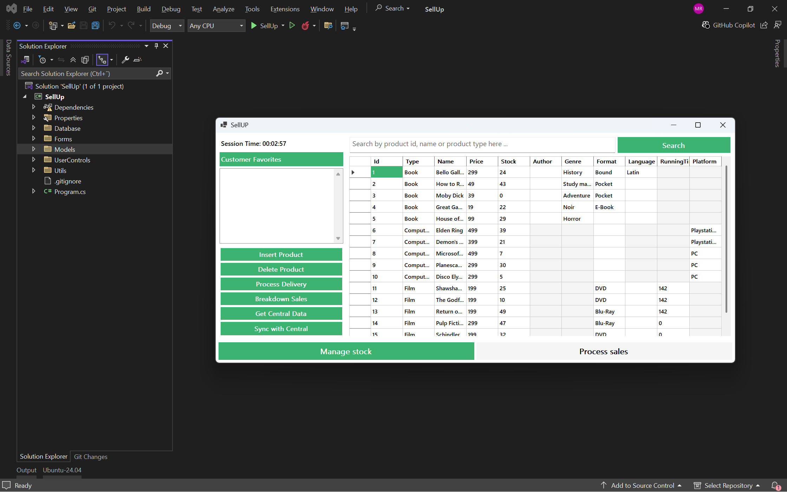
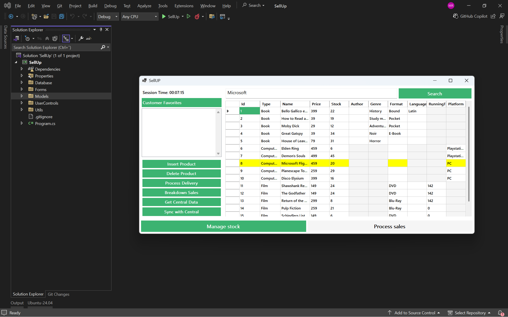
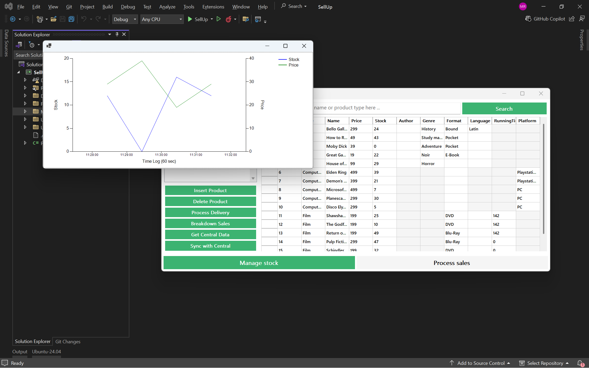
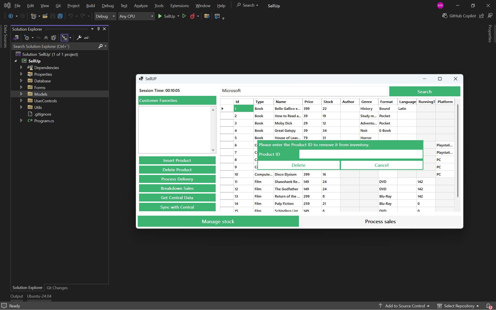

# SellUP - Inventory & Sales Management System

**SellUP** is a lightweight desktop application built in **C# using Windows Forms**, designed to manage **inventory** and **sales**. 

It offers a clean, user-friendly interface to track stock levels, maintain product information, process sales transactions, 
and generate reports — all within a reliable and responsive Windows environment.

Currently, SellUP integrates with an **external API** to **fetch and insert mock data** with realtime updates from the external API.
Current products in the application include books, computer games and movies. But can be developed further to support other types of data as well.

## Features

- **Inventory Management**
  - Add, delete, and update products
  - Real-time stock tracking
  - Search by ID, name, or type
- **Sales Processing**
  - Shopping cart system
  - Process purchases and returns
  - Total checkout calculation
- **Data Sync**
  - Fetch mock data from external API
  - Sync local inventory with central server
- **Search By id, name**
  - Search products by ID or name from the product table
- **Analytics**
  - Sales breakdown per product
  - Stock vs. Price trend visualization per product

## Screenshots

### A preview of some of the features in the application. 

### 1. Welcome Screen


### 2. Inventory Management


### 3. Shopping Cart & Checkout


### 4. Search functionality


### 5. Sales & Stock Analytics


### 6. Preview of the delete product feature



## Tech Stack

- **Language**: C# (.NET Framework / .NET Core)
- **UI Framework**: Windows Forms
- **IDE**: Visual Studio 2022
- **Data**: External REST API (mock data)
- **Version Control**: Git + GitHub

## Getting Started

### Prerequisites
- [Visual Studio 2022](https://visualstudio.microsoft.com/) (Community Edition is free)
- .NET Desktop Development workload

### Setup
1. Clone the repository:
   ```bash
   git clone https://github.com/mustafahrahimi/SellUP.git

2. Open SellUp.sln in Visual Studio

3. Press F5 to build and run

4. The app will auto-fetch mock data from the external API on launch.


